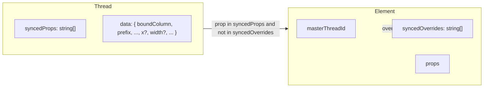

# Piano: Sincronizzazione e override proprietà per Synced Blocks

## Obiettivo

- **Default**: come oggi, solo il contenuto (boundColumn, prefix, suffix, text, fallbackLink) è sincronizzato; tutte le altre proprietà restano indipendenti.
- **Sync opzionale**: pulsante a destra di ogni proprietà nel pannello. Primo click = la proprietà viene sincronizzata per tutti gli elementi del thread (nome proprietà in **verde**).
- **Override (eccezione)**: secondo click sullo stesso pulsante = quella proprietà diventa **indipendente** per l’elemento corrente (nome in **blu**), senza influire sul “main” thread né sugli altri blocchi.
- Ciclo pulsante: non synced → synced (verde) → override (blu) → synced (verde).

## Modello dati

- **Thread** ([index.html](index.html) ~3724–3738, `createMasterThread`):
  - Aggiungere `syncedProps: string[]`. Default per retrocompatibilità: `['props.boundColumn','props.prefix','props.suffix','props.text','props.fallbackLink']`.
  - Estendere `thread.data` per memorizzare qualsiasi proprietà sincronizzata (es. `thread.data.x`, `thread.data.width`, `thread.data.textAlign`, `thread.data.regexRules`, ecc.). Valori con tipo corretto (number, boolean, string, oggetto/array per regexRules).
- **Elemento**:
  - Aggiungere `syncedOverrides: string[]` (default `[]`). Se una prop è in `thread.syncedProps` e in `el.syncedOverrides`, l’elemento usa il valore locale (stato blu).

## File e punti di intervento

- **[index.html](index.html)** – unico file da modificare.

### 1. Inizializzazione e backward compatibility

- In `createMasterThread`: inizializzare `syncedProps` con l’elenco delle 5 proprietà contenuto.
- Al caricamento snapshot/localStorage (dove si fa `masterDataThreads = parsed.masterDataThreads`): per ogni thread senza `syncedProps`, impostare `syncedProps` con le 5 proprietà contenuto.
- Quando si legge un elemento senza `syncedOverrides`, trattarlo come `[]`.

### 2. Helper e logica di sync generalizzata

- **getElementPropValue(el, propKey)**  
Restituisce il valore della proprietà sull’elemento (es. `propKey === 'x'` → `el.x`, `propKey === 'props.textAlign'` → `el.props.textAlign`). Per `props.regexRules` usare `deepCopy`.
- **setElementPropFromThread(el, propKey, value)**  
Applica il valore al singolo elemento (equivalente a `applyPropToElement(el, propKey, value)`; gestire anche tipi non stringa dove serve).
- **syncPropertyToThread(threadId, propKey, value)** (generalizzare la funzione esistente ~3904)  
  - Aggiornare `thread.data[propKey] = value` (con tipo appropriato).
  - Per ogni elemento con `masterThreadId === threadId` e senza `propKey` in `syncedOverrides`, applicare il valore con `setElementPropFromThread`.
  - Propagare come oggi a tutti i canvas/design (iterazione su `profiles` / `designs` / canvas1/canvas2), applicando solo agli elementi senza override per quella prop.
  - Mantenere la logica attuale per le proprietà “contenuto” (boundColumn, prefix, suffix, text, fallbackLink) e estenderla a qualsiasi `propKey` in `syncedProps`.
- **isPropSynced(thread, propKey)**  
`thread.syncedProps && thread.syncedProps.includes(propKey)`.
- **isPropOverridden(el, propKey)**  
`el.syncedOverrides && el.syncedOverrides.includes(propKey)`.
- **toggleSyncState(threadId, propKey, el)**  
  - Se prop non in `thread.syncedProps`: aggiungere a `syncedProps`, impostare `thread.data[propKey] = getElementPropValue(el, propKey)`, propagare a tutti gli elementi del thread (e rimuovere `propKey` da eventuali `syncedOverrides` dove presente), poi render/updateProps/save.
  - Se prop in `thread.syncedProps` e non in `el.syncedOverrides`: aggiungere `propKey` a `el.syncedOverrides` (stato blu).
  - Se prop in `thread.syncedOverrides`: rimuovere da `el.syncedOverrides` (torna verde).

### 3. Pannello proprietà (single element con masterThreadId)

- In **singlePropsPanel(el)** (~2558), quando `el.masterThreadId` è impostato:
  - Per **ogni proprietà** con `data-prop` (x, y, width, height, props.*, ecc.):
    - Valore mostrato: se `isPropSynced(thread, propKey) && !isPropOverridden(el, propKey)` usare `thread.data[propKey]`, altrimenti valore dall’elemento.
    - Colore label: verde se synced e non override, blu se synced e override, altrimenti normale.
    - Aggiungere a destra un pulsante (icona o simbolo, es. “⟳” o “sync”) che chiama `toggleSyncState(thread.id, propKey, el)`.
  - Layout: estendere la griglia da 2 a 3 colonne quando c’è sync (label | input | pulsante), ad es. `grid-template-columns: 90px 1fr 28px`. Per le righe che oggi hanno due coppie label/input (es. X/Y, Width/Height), avere due pulsanti (uno per prop) nella stessa riga (es. 6 colonne) o spezzare in due righe con una prop + pulsante ciascuna.
- Proprietà da considerare (stesso `data-prop` usato nel markup):  
`x`, `y`, `width`, `height`, `props.boundColumn`, `props.prefix`, `props.suffix`, `props.text`, `props.fallbackLink`, `props.decimals`, `props.asPercent`, `props.fontSize`, `props.fontFamily`, `props.fontWeight`, `props.lineHeight`, `props.textAlign`, `props.valign`, `props.textOverflow`, `props.rotation`, `props.paddingTop/Right/Bottom/Left`, `props.regexRules`, `props.showBorder`, `props.borderColor`, `props.borderWidth`, `props.borderTop/Right/Bottom/Left`, `props.borderRadius`*, `props.color`, `props.thickness`, `props.fillColor`, `props.objectFit`, e le altre specifiche per tipo (qr, barcode, image, line, box). Solo le proprietà effettivamente presenti nel pannello per quell’elemento avranno il pulsante.

### 4. Applicazione modifiche utente (input/change/blur)

- Negli handler **pp.addEventListener('input')** e **blur** e **change** (~7270, 7304, 7339):
  - Se `selectedIds.length === 1`, elemento ha `masterThreadId` e la proprietà modificata è in `thread.syncedProps` e **non** in `el.syncedOverrides`: oltre ad applicare al elemento, chiamare `syncPropertyToThread(el.masterThreadId, propKey, parsedValue)` (o valore adatto per textarea/blur).
  - Se la proprietà è in `syncedOverrides` o non è in `syncedProps`: solo `applyPropToElement` (nessuna propagazione al thread).

### 5. Caricamento valore dal thread quando si apre il pannello

- Quando si costruisce il pannello per un elemento con `masterThreadId`, per ogni prop in `thread.syncedProps` con valore in `thread.data` e non in `el.syncedOverrides`, il valore mostrato negli input deve essere `thread.data[propKey]` (già previsto al punto 3). Alla prima apertura dopo il load, se il thread ha `syncedProps` ma l’elemento non ha ancora quel valore applicato (es. thread caricato da file), applicare una volta i valori mancanti da `thread.data` agli elementi senza override (opzionale, può essere fatto in `updateProps` quando si costruisce il panel).

### 6. Persistenza e snapshot

- Assicurarsi che `syncedProps` e `thread.data` (incluse le nuove chiavi) siano inclusi in `saveCurrentDesign` / export snapshot e ripristinati in load/import (già copiati con `deepCopy(parsed.masterDataThreads)` se la struttura è serializzabile).
- Ogni elemento deve salvare `syncedOverrides` (array di stringhe) nel design/canvas; verificare che la serializzazione JSON degli elementi includa `syncedOverrides`.

### 7. Aggiunta elemento da thread (“Add from thread”)

- In `addElementFromThread` (~4110): dopo aver copiato i dati contenuto dal thread, applicare anche tutte le proprietà in `thread.syncedProps` i cui valori sono presenti in `thread.data` al nuovo elemento (e non impostare override di default), così il nuovo elemento rispetta subito le proprietà sincronizzate.  
  
  

## **Comportamento attuale**

In syncPropertyToThread (circa 4046–4079) quando aggiorni una proprietà sincronizzata:

1. Si aggiorna [thread.data](http://thread.data)[prop].

1. Si applica subito il valore a **tutti** gli elementi del thread in **tutti** i design (oltre a S), iterando su profiles → designs → canvas1/canvas2.

Quindi nel momento in cui attivi il sync (anche per sbaglio), il valore dell’elemento corrente diventa la baseline e viene scritto ovunque. Se poi togli il sync (terzo click), togli solo syncedProps e [thread.data](http://thread.data), ma i dati negli altri design sono già stati sovrascritti e non c’è nessun “ripristino”.

---

## **Soluzione 1: sync “lazy” (applicare solo quando apri il design)**

- **Idea**: non iterare sugli altri design dentro syncPropertyToThread. Aggiorni solo [thread.data](http://thread.data) e gli elementi del design **corrente** (S). Quando l’utente **apre** un altro design, in quel momento applichi [thread.data](http://thread.data) agli elementi di quel design (solo per le prop in syncedProps e non in override).

- **Pro**: nessuna scrittura immediata negli altri design; puoi sbagliare e togliere il sync senza aver mai “sporcato” i design che non hai riaperto.

- **Contro**: se dopo il sync per sbaglio apri un altro design, quel design riceve comunque il valore sbagliato. Tornando a “non synced” non si ripristina nulla: il danno è già fatto. Quindi la lazy da sola **non** risolve il caso “ho già aperto l’altro design”.

## Riepilogo implementazione

| Area                 | Azione                                                                                                                                                                                                          |
| -------------------- | --------------------------------------------------------------------------------------------------------------------------------------------------------------------------------------------------------------- |
| Thread               | Aggiungere `syncedProps` (default: 5 prop contenuto). Estendere `thread.data` a qualsiasi prop.                                                                                                                 |
| Element              | Aggiungere `syncedOverrides: string[]`.                                                                                                                                                                         |
| syncPropertyToThread | Generalizzare a qualsiasi `propKey`; usare `thread.data[propKey]` e applicare solo a elementi senza override.                                                                                                   |
| singlePropsPanel     | Per ogni prop con `data-prop`, se `el.masterThreadId`: valore da thread/element in base a sync/override, label verde/blu, pulsante sync che chiama toggleSyncState. Layout a 3 (o 6) colonne quando necessario. |
| input/change/blur    | Se prop synced e non override, chiamare syncPropertyToThread oltre ad applyPropToElement.                                                                                                                       |
| Load/snapshot        | Inizializzare `syncedProps` sui thread legacy; persistenza di `syncedOverrides` sugli elementi.                                                                                                                 |
| addElementFromThread | Applicare al nuovo elemento tutte le prop in `syncedProps` da `thread.data`.                                                                                                                                    |

## Note

- **Regex rules**: `props.regexRules` è un array di oggetti; in `thread.data` salvarlo con `deepCopy` e riapplicarlo con `setElementPropFromThread` senza modificare la struttura esistente delle regex.
- **Tipi**: in `syncPropertyToThread` e in `thread.data` gestire number, boolean, string e oggetti/array (regexRules) in modo che `applyPropToElement` / setter ricevano il tipo corretto.
- Il pulsante può essere un’icona piccola (es. “⟳” o “link”) con title/tooltip: “Sync property” / “Override for this element” / “Follow thread again” in base allo stato.

  
